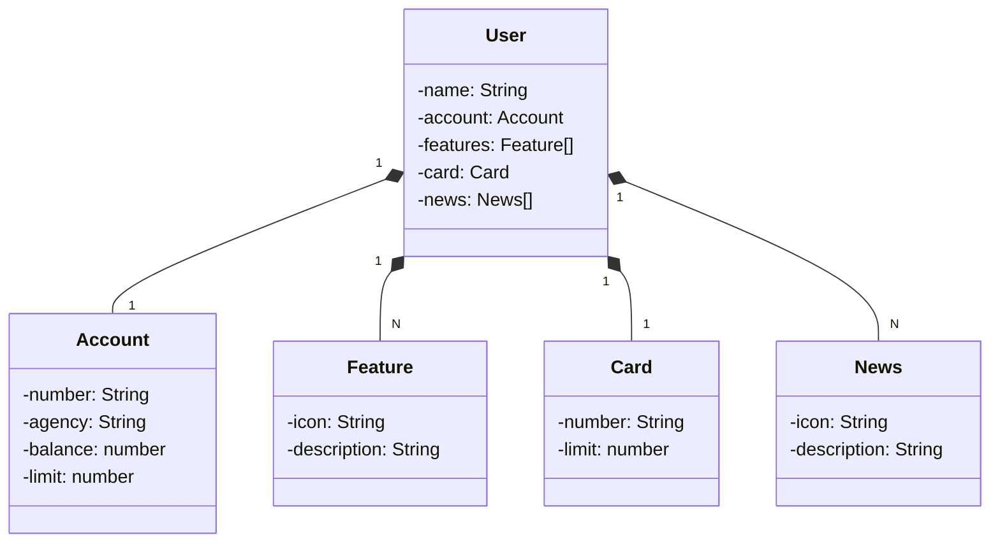

# Java API RESTful with Deploy on Railway - (DIO- Bootcamp Santander Fullstack Java  + Angular) 

## Main Technologies
- **Java 17**
- **Spring Boot 3**
- **Spring Data JPA**
- **OpenAPI (Swagger)**
- **Railway**

## Class Diagram

